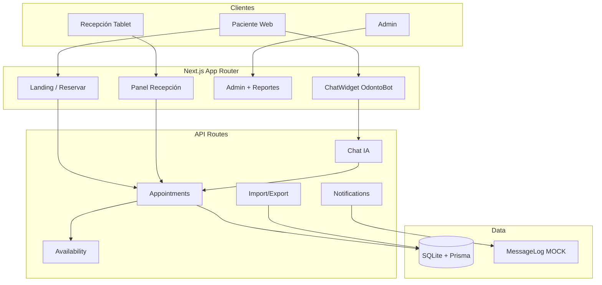

# Arquitectura — Odontoclinic

## Diagrama



## Decisiones técnicas

| Decisión | Elección | Justificación |
|----------|----------|---------------|
| Framework | Next.js 14 | SSR para landing, API routes integradas, mobile-first |
| Base de datos | SQLite + Prisma | Zero-config para MVP; migración trivial a PostgreSQL |
| Auth | Cookie session | Simple para demo; reemplazable por Supabase Auth |
| WhatsApp | Mock + MessageLog | Sin credenciales en desarrollo; listo para Twilio |
| IA | Rule-based + tools | Funciona sin API key; extensible a OpenAI function calling |

## Entidades

- `Patient`, `Dentist`, `Service`, `Appointment`
- `MessageLog`, `AiConversation`, `ClinicSettings`, `WaitlistEntry`, `User`

## Flujo de estados

```
PENDIENTE → CONFIRMADA → COMPLETADA
         ↘ CANCELADA
         ↘ NO_SHOW
```

## Automatizaciones

1. Al reservar → confirmación inmediata (mock WhatsApp)
2. 24h antes → recordatorio + solicitud confirmación
3. 2h antes → recordatorio corto (si confirmada)
4. Post-cita → agradecimiento
5. Sin confirmar → alerta recepción

Cron sugerido en producción: Vercel Cron → `POST /api/notifications/process`
